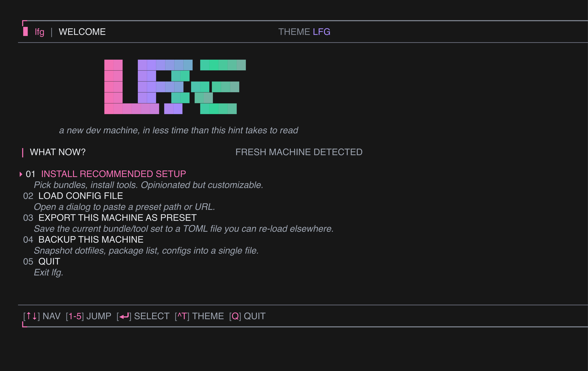
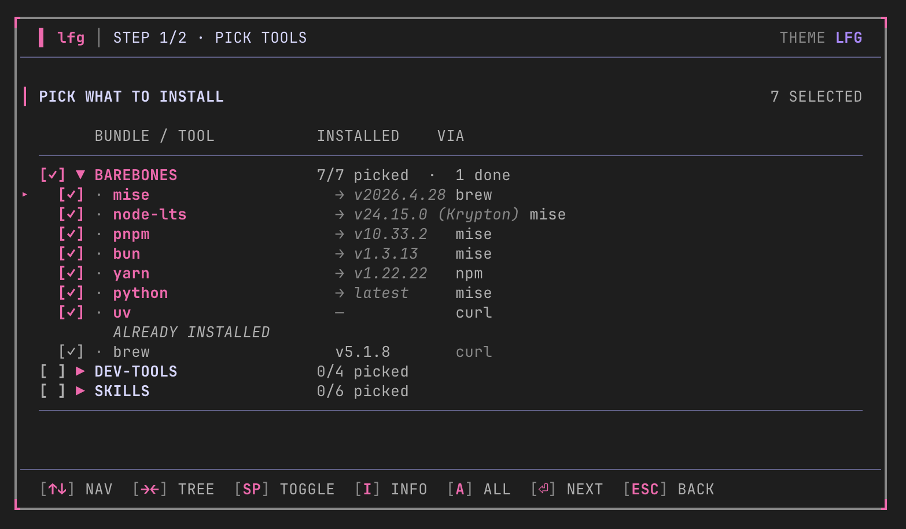
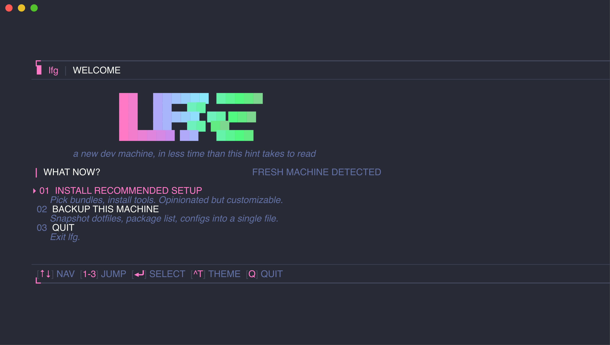
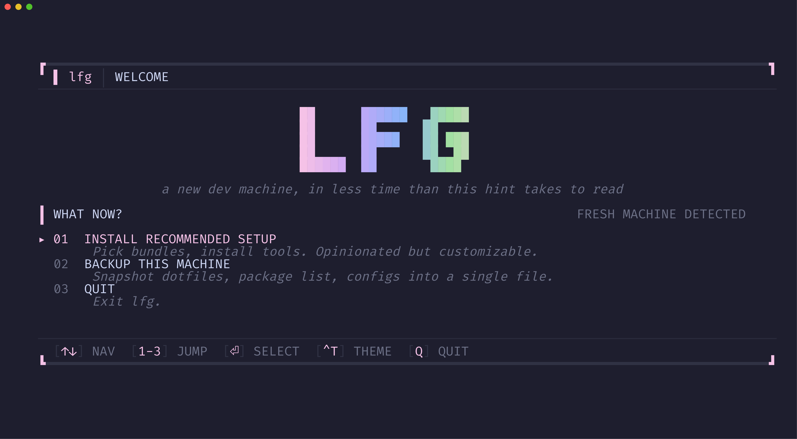

# lfg

> Make a new dev machine feel like home in minutes, not hours.

`lfg` is an opinionated, open-source TUI that bootstraps a fresh Mac or
Linux dev box — installs the tools you pick, restores your dotfiles, and
(eventually) distributes your SSH identity to the servers you already
trust. One `curl | sh` away on day one; one command to backup what you
have on day N.

**Status:** v0.1 ship — installers, detect, backup, doctor, and
self-update are all live. The TUI shells out to brew/apt/mise/npm
and streams output into the log tail. Snapshot tests still see a
deterministic mock so test runs don't touch your system.



## Why

Setting up a fresh machine eats a full evening:

1. Install Homebrew, mise, node, bun, go, …
2. Pull your dotfiles from somewhere.
3. Copy your SSH config, regenerate keys, add them to every server.
4. Tune a dozen macOS preferences.
5. Miss two of them, notice next Tuesday.

Existing tools solve parts of this (chezmoi, Omakub, dotbot, Nix). None
do the whole thing with a friendly interactive UI. `lfg` wraps the
best-in-class primitives — Homebrew, mise, chezmoi, age — in a
[Charm](https://charm.sh) TUI so the first five minutes on a new box
feel great.

## Screens

**Welcome** — animated gradient `LFG` logo, numbered actions.


**Tree picker** — bundles + tools as a collapsible tree. Status dots
(● all · ◐ partial · ○ none), tabular ID / NAME / STATE / COUNT layout.



**Themes** — three built-in palettes, cycle live with `Ctrl+T`.

| LFG (default) | Dracula | Catppuccin |
|---|---|---|
|  |  |  |

## Flow

1. **Welcome** — pick install or backup. Logo gradient sweeps live.
2. **Tree picker** — expand a bundle (→), toggle individual tools
   (space), or toggle a whole bundle. `a` toggles everything.
3. **Confirm** — telemetry-style summary: total to install, already
   present, source breakdown (brew · mise · custom).
4. **Progress** — gradient bar, spinner, log tail, elapsed timer.
5. **Done** — next-steps card.

Backup flow: `huh.Confirm` for encrypt y/n → spinner → `.tar[.age]`
result with key-backup reminder.

Press `q` from any screen → quit-confirm dialog.
Press `Ctrl+T` from any screen → cycle theme.

## Install

```sh
curl -fsSL https://raw.githubusercontent.com/ptmaroct/lfg/main/install.sh | sh
```

The script grabs the latest release tarball for your OS/arch from
GitHub, drops the `lfg` binary in `/usr/local/bin` (or `~/.local/bin`
when /usr/local isn't writable). Override prefix or pin a version:

```sh
LFG_VERSION=v0.1.0 LFG_PREFIX=$HOME/.local sh install.sh
```

Building from source needs Go 1.22+:

```sh
git clone https://github.com/ptmaroct/lfg
cd lfg
go build -o lfg ./cmd/lfg
./lfg
```

## Usage

```sh
lfg                        # launch TUI (default theme)
lfg --theme=dracula        # explicit theme override
lfg apply                  # headless install of the 'default' bundle
lfg apply default ai-clis  # multiple bundles, non-interactively
lfg apply --dry-run        # preview commands without running them
lfg backup                 # snapshot dotfiles + configs (tar.age)
lfg backup --no-encrypt    # plain tar.gz instead
lfg doctor                 # diagnose environment readiness
lfg version --verbose      # print build metadata
lfg update                 # self-update from GitHub releases
```

Theme persists in `~/.config/lfg/state.json` so `--theme` is only needed once.

### Key bindings

| Key | Action |
|---|---|
| `↑ ↓ j k` | move |
| `→ ←` | expand / collapse (tree) |
| `space` `x` | toggle option |
| `a` | toggle all (tree) |
| `enter` | confirm / continue |
| `1`–`3` | jump to action (welcome) |
| `esc` | back |
| `q` | quit (confirm dialog) |
| `Ctrl+T` | cycle theme |
| `Ctrl+C` | force quit |

## Architecture

| Layer | Choice |
|-------|--------|
| Language | Go 1.22+ |
| TUI framework | [bubbletea](https://github.com/charmbracelet/bubbletea) |
| Components | [bubbles](https://github.com/charmbracelet/bubbles) — spinner, progress, stopwatch |
| Forms | [huh](https://github.com/charmbracelet/huh) — select, multi-select, confirm |
| Styles | [lipgloss](https://github.com/charmbracelet/lipgloss) |
| Config format | TOML |
| CLI lib | [cobra](https://github.com/spf13/cobra) — subcommand dispatch |
| Encryption | [age](https://github.com/FiloSottile/age) — backup payloads |
| Self-update | [minio/selfupdate](https://github.com/minio/selfupdate) |
| Packaging | [goreleaser](https://goreleaser.com) → tarballs + `install.sh` |

## Repo layout

```
lfg/
├── cmd/
│   ├── lfg/main.go             thin entry — calls cli.Execute()
│   └── snap/main.go            screen → ANSI text helper for screenshots
├── internal/
│   ├── cli/                    cobra subcommands (root, apply, backup, doctor, ...)
│   ├── preset/                 bundle + tool data (hardcoded for v0.1)
│   ├── detect/                 binary + version probe (concurrent, timeout-bounded)
│   ├── installer/              brew/apt/mise/npm/custom + streaming exec
│   ├── backup/                 tar + age snapshot pipeline
│   ├── doctor/                 environment readiness checks
│   ├── state/                  ~/.config/lfg/state.json
│   ├── version/                ldflags-injected build metadata
│   └── tui/
│       ├── app.go              screen state machine + global hotkeys
│       ├── theme.go            3 palettes + huh theme builder
│       ├── layout.go           Frame(): outer chrome, centering
│       ├── title.go            hand-drawn block logo + gradient sweep
│       ├── welcome.go          animated hero + numbered actions
│       ├── tree_picker.go      collapsible bundle/tool tree
│       ├── confirm.go          stats row + huh.Confirm
│       ├── progress.go         channel-driven log tail wired to installer
│       ├── done.go             next-steps card
│       ├── backup.go           huh.Confirm (encrypt) → spinner → result
│       └── quit_confirm.go     huh.Confirm dialog (`q` from anywhere)
├── .goreleaser.yaml            release config (4 OS/arch combos)
├── .github/workflows/release.yml  CI release on tag push
├── install.sh                  curl|sh installer
└── assets/                     screenshots
```

## Development

```sh
make build           # ./lfg binary
make run             # build + run
make test            # snapshot tests across 6 widths × 3 themes (~0.6s)
make snap-update     # regenerate testdata/*.golden after intentional UI change
make preview                     # page through every golden in less -R
make preview ARGS=welcome        # filter goldens by substring
make widths          # static PNGs per width (needs `freeze`)
make demo            # animated gif (needs `vhs`)
make docker          # build container image (Ubuntu + linuxbrew)
make docker-run      # launch TUI in container
make release-snapshot  # local goreleaser build of all 4 targets (no upload)
```

Single test:

```sh
go test ./internal/tui -run TestSnapshot_Welcome/welcome_lfg_md_100x30
```

Snapshots use direct `View()` calls (not teatest byte streams) so the
goldens are clean ANSI-stripped text — diffable in any review tool.

## Roadmap

**v0.1 (MVP)** — shipped

- [x] TUI skeleton with all screens
- [x] Animated gradient logo, tactical bulletin chrome
- [x] 3 themes, swappable via `--theme` or `Ctrl+T`
- [x] Tree picker with bundle/tool selection
- [x] Quit-confirm dialog
- [x] Real package installers (brew, apt, mise, npm, custom)
- [x] Binary-present + version detection
- [x] Real `lfg backup` → tar + optional age encrypt
- [x] `lfg doctor` env checks
- [x] `lfg update` self-update
- [x] goreleaser + `install.sh`
- [ ] Fetch `default.toml` from presets repo (next iteration; bundles are still hardcoded)

**v0.2** — sync

- GitHub device-flow auth
- Dedicated `lfg-config` repo per user
- `lfg sync` / `lfg apply` / `lfg diff`
- Dotfile restore (not just backup)

**v0.3** — SSH + macOS

- `lfg ssh list` (wishlist-powered)
- `lfg ssh add-device` (fleet pubkey push)
- macOS `defaults` + `systemsetup` wizard

**Deferred / v1+**

- Hosted paid sync tier
- Plugin system for user-authored install recipes
- Teams / shared configs
- Windows support

## Design principles

1. **Wrap, don't reinvent.** chezmoi, mise, brew, age already work.
   `lfg` is the opinionated interactive layer on top.
2. **Use Charm components.** This project lives in the Charm
   ecosystem; if `huh`/`bubbles` ships a primitive, use it instead of
   hand-rolling. See `CLAUDE.md` for the rule.
3. **Never silently touch user data.** Private SSH keys stay on-device
   by default. Secrets are encrypted client-side; the master key never
   leaves the user's control.
4. **Beautiful beats clever.** First five minutes are the product. If
   it doesn't look great, nobody runs step two.
5. **Ship-able MVP.** UX-first prototype before installers, installers
   before sync, sync before the kitchen sink.

## Contributing

Early days. Open an issue before a PR so we can align on scope.

## License

TBD — likely MIT.
