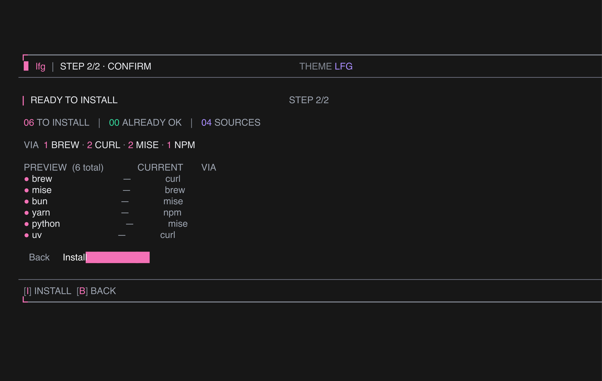
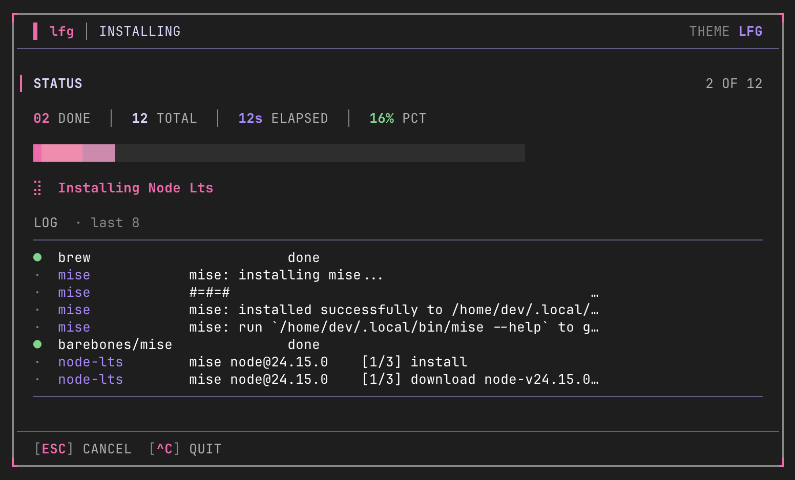

# lfg

> Make a new dev machine feel like home in minutes.

`lfg` is an open-source TUI that bootstraps a fresh Mac or Linux dev
box — installs the tools you pick, restores your dotfiles, and (soon)
distributes your SSH identity to the servers you trust.

📖 **Full docs:** [lfg-docs.netlify.app](https://lfg-docs.netlify.app)


## Install

Homebrew (macOS + Linux):

```sh
brew install ptmaroct/tap/lfg
```

Want the preview channel? `brew install ptmaroct/tap/lfg-beta` follows the
`develop` branch — newer features, fewer guarantees.

Or via the curl one-liner:

```sh
curl -fsSL https://raw.githubusercontent.com/ptmaroct/lfg/main/install.sh | sh
```

Or from source (Go 1.25+):

```sh
git clone https://github.com/ptmaroct/lfg && cd lfg && make build && ./lfg
```

## Quick start

```sh
lfg              # launch the TUI
lfg --help       # all subcommands and flags
```

## The journey

### 1. Land

Drop into the welcome screen with a quick rundown of what `lfg` will
do on this box.


### 2. Pick

Bundles + tools as a collapsible tree. Already-installed tools are
flagged with their current version so you don't reinstall.


### 3. Confirm

See the exact `brew install` / `apt-get install` / `mise use` /
`npm i -g` commands that will run, before they run.



### 4. Install

Each step streams live. PATH is re-augmented between steps so the
next installer always sees what the previous one put down.



## Why

Setting up a fresh machine eats an evening: brew, mise, node, dotfiles,
SSH config, macOS preferences. `lfg` wraps the best-in-class primitives
(Homebrew, mise, chezmoi, age) in a [Charm](https://charm.sh) TUI so
the first five minutes on a new box feel great.

**Status:** v0.3 — installers, PostInstall hooks, async live version
resolver, `lfg backup`, `lfg doctor`, `lfg update`, four themes.

## Develop

```sh
make build           # ./lfg
make test            # snapshot tests across widths × themes
make snap-update     # regenerate goldens after intentional UI change
make docker-test     # one-shot: build + auto-run lfg --debug + bash on exit
make docs            # local docs site (http://localhost:5173/)
```

See [docs/project/contributing](https://lfg-docs.netlify.app/project/contributing)
for the full list and house rules.

## Version management & supply-chain safety

Every tool in the default preset is **version-pinned**. The pins live
in `internal/preset/pins.toml` and are maintained by an automated
weekly bot — `.github/workflows/preset-bump.yml` — that runs every
Monday and opens a PR with any version advances. The bot only proposes
a version that has been live on its upstream registry for **at least
7 days** (the quarantine window) so a freshly-published malicious
release can never slip into our default preset before the wider
ecosystem has had a chance to flag it.

What this defends against, drawn from the 2025–2026 supply-chain
incident wave:

- **Compromised npm packages** (chalk/debug Sep 2025, axios Mar 2026,
  Shai-Hulud worms). Most malicious versions were unpublished within
  hours; the 7-day quarantine renders the install path immune.
- **Tampered curl-bash install scripts** (uv, brew, mise, claude-code,
  opencode, droid). Every curl-piped installer is downloaded, its
  body's SHA256 verified against the pin, and only then executed via
  a temp-file shell exec — see `internal/installer/verify.go`.
- **GitHub Actions tag-rewrite attacks** (tj-actions/changed-files
  CVE-2025-30066). Every `uses:` in `.github/workflows/` is pinned to
  a full commit SHA, with the human-readable tag as a comment.
  Dependabot keeps those SHAs current via reviewed PRs.

Full design + threat model: [docs/versioning.md](docs/versioning.md).

### How lfg picks up new pins

```
Mon 06:00 UTC   preset-bump bot opens a PR with the week's diff
Mon–Wed          maintainer reviews + merges
Wed              release-on-pins.yml tags vX.Y.Z+1
Wed              goreleaser publishes binaries + brew bottle
Wed–Sun          new lfg installs pick up fresh pins via brew/curl;
                 existing binaries fetch the latest pins.toml from
                 raw.githubusercontent.com at startup (2 s timeout,
                 fail-closed to the embedded copy)
```

Two delivery paths so a stale binary still installs current versions:
(a) update the binary (`lfg update`), or (b) keep running the binary
— it asynchronously fetches the latest `pins.toml` on launch and
uses it for that session. The welcome screen surfaces the active pin
set's age as a small chip; once you cross 30 days it turns red and
prompts `lfg update`.

### Override

Run `lfg --config ./my-preset.toml` to bypass the shipped preset
entirely. Inline `pin = "x.y.z"` / `pin_sha256 = "..."` fields on any
`[[bundles.tools]]` entry are honored — see the schema in
[docs/versioning.md](docs/versioning.md).

## Contributing

Open an issue before a PR so we can align on scope. Roadmap:
[docs/project/roadmap](https://lfg-docs.netlify.app/project/roadmap).

## License

MIT.

---

Built by **[Anuj Sharma](https://anujsh.com)** · [@waahbete](https://x.com/waahbete) · [GitHub](https://github.com/ptmaroct/lfg)
