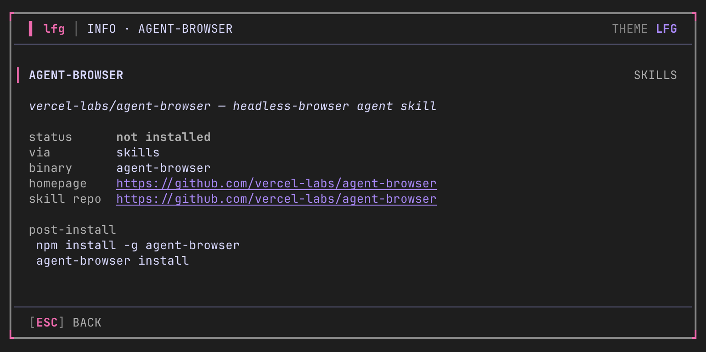
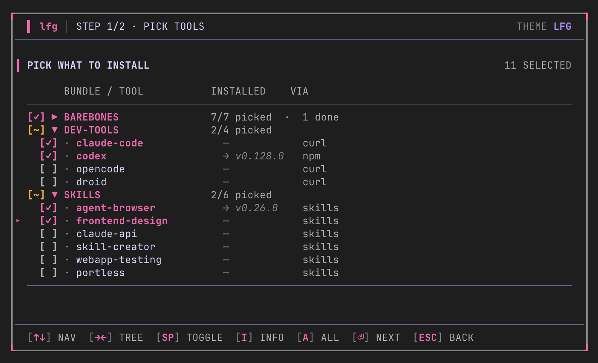

# lfg

> Make a new dev machine feel like home in minutes, not hours.

`lfg` is an opinionated, open-source TUI that bootstraps a fresh Mac or
Linux dev box — installs the tools you pick, restores your dotfiles, and
(eventually) distributes your SSH identity to the servers you already
trust. One `curl | sh` away on day one; one command to backup what you
have on day N.

**Status:** v0.1 ship — installers, detect, backup, doctor, and
self-update are all live. The TUI shells out to brew/apt/mise/npm
and streams output into the log tail. Snapshot tests still see a
deterministic mock so test runs don't touch your system.


## Why

Setting up a fresh machine eats a full evening:

1. Install Homebrew, mise, node, bun, go, …
2. Pull your dotfiles from somewhere.
3. Copy your SSH config, regenerate keys, add them to every server.
4. Tune a dozen macOS preferences.
5. Miss two of them, notice next Tuesday.

Existing tools solve parts of this (chezmoi, Omakub, dotbot, Nix). None
do the whole thing with a friendly interactive UI. `lfg` wraps the
best-in-class primitives — Homebrew, mise, chezmoi, age — in a
[Charm](https://charm.sh) TUI so the first five minutes on a new box
feel great.

## Screens

**Welcome** — animated gradient `LFG` logo, numbered actions, theme
indicator in the top-right of the chrome.


**Tree picker** — bundles + tools as a collapsible tree. Live versions
resolved from npm registry / brew api / nodejs.org dist index. Tools
nest under their bundle, `[●]` marks mandatory, `[✓]` marks selected,
`ALREADY INSTALLED` section calls out anything already on the host.


**Tool info** — `i` on any tool opens an info card. Surfaces the
homepage / repo, install command, and any `post_install` steps that
will run after the main install.



**Skills + dev-tools** — pick AI coding CLIs and cross-harness skills.
Skills bundle is gated until `node-lts` is selected (skills install via
`npx skills add`).



**Install** — gradient progress bar, per-task tag column on every log
line, humanized current step (`Installing Claude Code` not
`dev-tools/claude-code`).


**Themes** — four built-in palettes, cycle live with `Ctrl+T`. Theme
name is shown in the top-right of every screen so cycles are visible.

| LFG (default) | Dracula | Catppuccin | Colorblind (IBM blue/orange) |
|---|---|---|---|
|  |  |  | shipped |

## Flow

1. **Welcome** — pick install or backup. Logo gradient sweeps live.
2. **Tree picker** — expand a bundle (→), toggle individual tools
   (space), or toggle a whole bundle. `a` toggles everything.
3. **Confirm** — telemetry-style summary: total to install, already
   present, source breakdown (brew · mise · custom).
4. **Progress** — gradient bar, spinner, log tail, elapsed timer.
5. **Done** — next-steps card.

Backup flow: `huh.Confirm` for encrypt y/n → spinner → `.tar[.age]`
result with key-backup reminder.

Press `q` from any screen → quit-confirm dialog.
Press `Ctrl+T` from any screen → cycle theme.

## Install

```sh
curl -fsSL https://raw.githubusercontent.com/ptmaroct/lfg/main/install.sh | sh
```

The script grabs the latest release tarball for your OS/arch from
GitHub, drops the `lfg` binary in `/usr/local/bin` (or `~/.local/bin`
when /usr/local isn't writable). Override prefix or pin a version:

```sh
LFG_VERSION=v0.1.0 LFG_PREFIX=$HOME/.local sh install.sh
```

Building from source needs Go 1.25+:

```sh
git clone https://github.com/ptmaroct/lfg
cd lfg
go build -o lfg ./cmd/lfg
./lfg
```

## Usage

```sh
lfg                              # launch TUI (default theme)
lfg --theme=dracula              # explicit theme override
lfg apply barebones              # headless install of one bundle
lfg apply barebones dev-tools    # multiple bundles, non-interactively
lfg backup                       # snapshot dotfiles + configs (locked by default)
lfg backup --encrypt=false       # plain tarball, no key needed to open
lfg export                       # save current preset → ~/lfg-preset-<date>.toml
lfg export -o ./my-preset.toml   # explicit output path
lfg --config ./my-preset.toml    # load custom bundles instead of the built-in ones
lfg --config https://example.com/preset.toml   # remote preset over http(s)
lfg doctor                       # diagnose environment readiness
lfg version --verbose            # print build metadata
lfg update                       # self-update from GitHub releases
```

`--dry-run` (or `-n`) is a persistent flag — works on every command:

```sh
lfg -n                     # walk the TUI flow with the install step mocked
lfg apply -n barebones     # print planned commands, exec nothing
lfg backup -n              # list source counts + would-be filename, write nothing
lfg export -n              # print the path it would write, no file created
```

Theme persists in `~/.config/lfg/state.json` so `--theme` is only needed once.

### Key bindings

| Key | Action |
|---|---|
| `↑ ↓ j k` | move |
| `→ ←` | expand / collapse (tree) |
| `space` `x` | toggle option |
| `a` | toggle all (tree) |
| `i` | tool info (description, homepage, install command) |
| `enter` | confirm / continue |
| `1`–`5` | jump to action (welcome) |
| `esc` | back |
| `q` | quit (confirm dialog) |
| `Ctrl+T` | cycle theme |
| `Ctrl+C` | force quit |

### Custom presets

Pass any TOML file as `--config`. The schema mirrors the built-in preset
(see `testdata/sample-preset.toml`):

```toml
[[bundles]]
id = "minimal"
name = "minimal"
default = true

  [[bundles.tools]]
  name = "git"
  source = "brew"
  homepage = "https://git-scm.com"
  install_mac = "brew install git"
  install_linux = "sudo apt-get install -y git"
```

Mark a tool `mandatory = true` to make it always-on (rendered with `[●]`,
can't be unchecked). Use `source = "skills"` + `skill_url = "..."` for
agent skills installed via `npx skills add`.

Round-trip your current setup:

```sh
lfg export                  # save → ~/lfg-preset-YYYY-MM-DD.toml
# move the file to a new machine
lfg --config ./preset.toml  # bundles, mandatories, install commands all preserved
```

### Backup — what's in it, where it goes

`lfg backup` collects a curated list of files from your home directory
into a single archive. Source groups (each one is silently skipped if
nothing matches):

- **Shell config** — `.zshrc`, `.zprofile`, `.zshenv`, `.bashrc`, `.bash_profile`, `.profile`
- **Editors / dotfiles** — `.gitconfig`, `.tmux.conf`, `.vimrc`, `.editorconfig`, `.inputrc`
- **Starship + dev tool configs** — `~/.config/{starship,mise,bat,btop,lazygit,yazi,glow}`
- **Editor configs** — `~/.config/{nvim,zed,ghostty,zellij}`
- **AI tool settings** — `~/.claude/{settings.json,CLAUDE.md,agents,commands}`, `~/.codex/config.toml`
- **SSH** — `~/.ssh/` (config + public keys; **private keys are NEVER copied** unless you pass `--include-ssh-keys` *and* enable encryption)

The TUI shows you this exact list with `●`/`○` presence dots before
asking you to confirm — no surprise inclusions.

**Why tar (not zip):** preserves UNIX file modes and symlinks, which
matters for SSH config + dotfile hierarchies. zip mangles both. The
output is `tar.gz` (plain) or `tar.age` (locked with a key from
[age](https://github.com/FiloSottile/age)).

**The "lock it" option:**

- *Locked* — file is encrypted with a key at `~/.config/lfg/key.txt`.
  Only that key can open it. Pick this if the backup will leave your
  machine (cloud sync, USB, email). **Back up the key file separately**
  — without it, even you can't recover the archive.
- *Skip lock* — plain `.tar.gz`. Anyone with the file can read it.
  Pick this when the archive stays on this machine and you want to
  peek inside (`tar -tzf <file>`).

**Restore later:** the result screen shows the exact `lfg backup --restore <path>`
command for whichever option you picked.

## Architecture

| Layer | Choice |
|-------|--------|
| Language | Go 1.25+ |
| TUI framework | [bubbletea](https://github.com/charmbracelet/bubbletea) |
| Components | [bubbles](https://github.com/charmbracelet/bubbles) — spinner, progress, stopwatch |
| Forms | [huh](https://github.com/charmbracelet/huh) — select, multi-select, confirm |
| Styles | [lipgloss](https://github.com/charmbracelet/lipgloss) |
| Config format | TOML |
| CLI lib | [cobra](https://github.com/spf13/cobra) — subcommand dispatch |
| Encryption | [age](https://github.com/FiloSottile/age) — backup payloads |
| Self-update | [minio/selfupdate](https://github.com/minio/selfupdate) |
| Packaging | [goreleaser](https://goreleaser.com) → tarballs + `install.sh` |

## Repo layout

```
lfg/
├── cmd/
│   ├── lfg/main.go             thin entry — calls cli.Execute()
│   └── snap/main.go            screen → ANSI text helper for screenshots
├── internal/
│   ├── cli/                    cobra subcommands (root, apply, backup, doctor, ...)
│   ├── preset/                 bundle + tool data (hardcoded for v0.1)
│   ├── detect/                 binary + version probe (concurrent, timeout-bounded)
│   ├── installer/              brew/apt/mise/npm/custom + streaming exec
│   ├── backup/                 tar + age snapshot pipeline
│   ├── doctor/                 environment readiness checks
│   ├── state/                  ~/.config/lfg/state.json
│   ├── version/                ldflags-injected build metadata
│   └── tui/
│       ├── app.go              screen state machine + global hotkeys
│       ├── theme.go            3 palettes + huh theme builder
│       ├── layout.go           Frame(): outer chrome, centering
│       ├── title.go            hand-drawn block logo + gradient sweep
│       ├── welcome.go          animated hero + numbered actions
│       ├── tree_picker.go      collapsible bundle/tool tree
│       ├── confirm.go          stats row + huh.Confirm
│       ├── progress.go         channel-driven log tail wired to installer
│       ├── done.go             next-steps card
│       ├── backup.go           huh.Confirm (encrypt) → spinner → result
│       └── quit_confirm.go     huh.Confirm dialog (`q` from anywhere)
├── .goreleaser.yaml            release config (4 OS/arch combos)
├── .github/workflows/release.yml  CI release on tag push
├── install.sh                  curl|sh installer
└── assets/                     screenshots
```

## Development

```sh
make build           # ./lfg binary
make run             # build + run
make test            # snapshot tests across 6 widths × 3 themes (~0.6s)
make snap-update     # regenerate testdata/*.golden after intentional UI change
make preview                     # page through every golden in less -R
make preview ARGS=welcome        # filter goldens by substring
make widths          # static PNGs per width (needs `freeze`)
make demo            # animated gif (needs `vhs`)
make docker          # build container image (clean Ubuntu 24.04 + lfg binary)
make docker-run      # launch TUI in container
make docker-shell    # blank Ubuntu shell, `lfg` on PATH
make docker-test     # one-shot: build + auto-run `lfg --debug` + bash on exit
make release-snapshot  # local goreleaser build of all 4 targets (no upload)
```

Single test:

```sh
go test ./internal/tui -run TestSnapshot_Welcome/welcome_lfg_md_100x30
```

Snapshots use direct `View()` calls (not teatest byte streams) so the
goldens are clean ANSI-stripped text — diffable in any review tool.

### Testing on a fresh Linux box (Docker)

Smoke-test on a clean machine — no leftover dotfiles, no brew, no AI
CLIs skewing detect. `Dockerfile` is a bare Ubuntu 24.04 with the
`lfg` binary baked in; lfg bootstraps everything else (brew, mise,
node) so the test loop exercises the real install paths.

**Tightest loop** — one command rebuilds, runs, auto-launches debug,
drops you into bash on exit:

```sh
make docker-test
```

**Other targets:**

```sh
make docker          # just build the image (warm cache ~10s)
make docker-run      # launch TUI in fresh container
make docker-shell    # bash inside fresh container, `lfg` on PATH
```

**Verify a custom preset end-to-end** — serve preset from host, point
container at it:

```sh
# terminal 1
python3 -m http.server 8000 --directory testdata

# terminal 2
docker run --rm -it --network host lfg lfg --config http://localhost:8000/sample-preset.toml
```

**Reset state** — containers run with `--rm`, filesystem dies on exit.
Each `make docker-test` = fresh `~/.config/lfg/`. Nothing persists
unless you mount a volume.

**What to verify in the clean container**:

1. Welcome screen shows 5 menu items (Install / Load config / Export /
   Backup / Quit).
2. Tree picker: `INSTALLED` column shows `→ v<x.y.z>` for npm/brew
   tools (live registry lookup); `brew` row sits in `BAREBONES` with a
   `[●]` mandatory checkbox.
3. Skills bundle is gated until `node-lts` is selected — toggling
   blocked with a `REQUIRES node-lts` subheader otherwise.
4. After install, the lfg-managed `# lfg-managed PATH` block is
   appended to `~/.bashrc` (and `~/.zshrc` if it exists), idempotent
   on re-runs. Done screen prints the right reload command for the
   active shell (`exec bash` / `exec zsh` / `exec fish`).
5. PostInstall failures (e.g. `agent-browser install` on linux/arm64
   where Chrome for Testing has no build) surface as warnings — main
   skill stub still installs cleanly.
6. Full transcript at `~/.config/lfg/logs/install-*.log`; `--debug`
   adds a process log alongside.

## Roadmap

**v0.1 (MVP)** — shipped

- [x] TUI skeleton with all screens
- [x] Animated gradient logo, tactical bulletin chrome
- [x] 3 themes, swappable via `--theme` or `Ctrl+T`
- [x] Tree picker with bundle/tool selection
- [x] Quit-confirm dialog
- [x] Real package installers (brew, apt, mise, npm, custom)
- [x] Binary-present + version detection
- [x] Real `lfg backup` → tar + optional age encrypt
- [x] `lfg doctor` env checks
- [x] `lfg update` self-update
- [x] goreleaser + `install.sh`
- [ ] Fetch `default.toml` from presets repo (next iteration; bundles are still hardcoded)

**v0.2** — sync

- GitHub device-flow auth
- Dedicated `lfg-config` repo per user
- `lfg sync` / `lfg apply` / `lfg diff`
- Dotfile restore (not just backup)

**v0.3** — SSH + macOS

- `lfg ssh list` (wishlist-powered)
- `lfg ssh add-device` (fleet pubkey push)
- macOS `defaults` + `systemsetup` wizard

**Deferred / v1+**

- Hosted paid sync tier
- Plugin system for user-authored install recipes
- Teams / shared configs
- Windows support

## Design principles

1. **Wrap, don't reinvent.** chezmoi, mise, brew, age already work.
   `lfg` is the opinionated interactive layer on top.
2. **Use Charm components.** This project lives in the Charm
   ecosystem; if `huh`/`bubbles` ships a primitive, use it instead of
   hand-rolling. See `CLAUDE.md` for the rule.
3. **Never silently touch user data.** Private SSH keys stay on-device
   by default. Secrets are encrypted client-side; the master key never
   leaves the user's control.
4. **Beautiful beats clever.** First five minutes are the product. If
   it doesn't look great, nobody runs step two.
5. **Ship-able MVP.** UX-first prototype before installers, installers
   before sync, sync before the kitchen sink.

## Contributing

Early days. Open an issue before a PR so we can align on scope.

## License

TBD — likely MIT.
